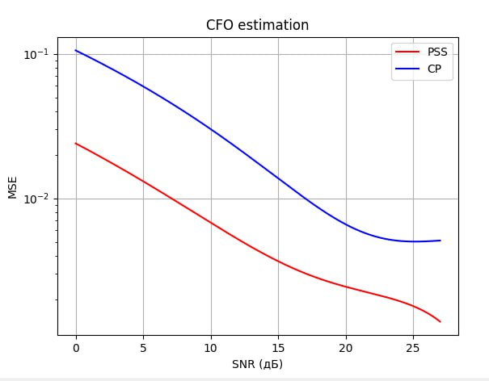

# Выбор частотной синхронизации 


## Частотная синхронизация по PSS

Синхронизация по PSS использует первичные синхронизационные сигналы, которые являются специальными последовательностями(Zadoff-Chu), передающимися на начальном этапе передачи. 

- Преимущества:
  - Высокая точность синхронизации.
  - Эффективность в условиях низкого уровня сигнала.

- Недостатки:
  - Требуется знать на приемной стороне.
  - Увеличенные требования к вычислительным ресурсам для обработки PSS.

#### Схема частотной синхронизации по PSS


Алгоритм: Autocorrelation Synchronization (ACS)

- выражение для реализации:


$$\theta$$

- $$r(\hat{\theta}+k)$$ – принятый сигнал во временной области.
- $$\hat{\theta}$$ – оценка времени синхронизации.
- $$p^*_i(k)$$ – известный PSS сигнал.
- $$N$$ – количество отсчетов сигнала.
- $$i$$ – индекс текущего Cell ID (у нас используется один PSS).
- $$\angle$$ – операция определения аргумента комплексного числа

## Основные Формулы


### Реализация 
```c++
    vector<std::complex<double>> partA(pss.size() + matrix_name.size() - 1, 0);
    for (size_t i = 0; i < pss.size() / 2; i++) {
        for (size_t j = 0; j < matrix_name.size(); j++) {
            partA[i + j] += corr_coef[i] * matrix_name[j];
        }
    }

    vector<std::complex<double>> xDelayed(matrix_name.size());
    for (size_t i = 0; i < matrix_name.size() ; i++) {
        
        if(i < pss.size() / 2){
            xDelayed[i] = 0;
        }
        else{
            xDelayed[i] = matrix_name[i];
        }
    }

    
    vector<std::complex<double>> partB(pss.size() + matrix_name.size() - 1, 0);
    for (size_t i = pss.size() / 2; i < pss.size(); i++) {
        for (size_t j = 0; j < xDelayed.size(); j++) {
            partB[i + j] += corr_coef[i] * xDelayed[j];
        }
    }


    vector<double> correlation(pss.size() + matrix_name.size() - 1, 0);
    for (size_t i = 0; i < correlation.size(); i++) {
        correlation[i] = abs(partA[i] + partB[i]);
    }
    vector<std::complex<double>> phaseDiff(pss.size() + matrix_name.size() - 1, 0);
    for (size_t i = 0; i < phaseDiff.size(); i++) {
        phaseDiff[i] = partA[i] * conj(partB[i]);
    }


    size_t istart = argmax(correlation) ;
    std::complex<double> phaseDiff_max = phaseDiff[istart];


    double CFO = arg(phaseDiff_max) / (M_PI * 1 / m);
    vector<double> t(matrix_name.size());
    for (size_t i = 0; i < t.size(); i++) {
        t[i] = i ;
    }

    //cout << "CFO :" << conj(CFO) << endl;
    //CFO = -7018.845944622955;
    // Offset the data
    data_offset.resize(matrix_name.size());
    for (size_t i = 0; i < matrix_name.size(); i++) {
        
        data_offset[i] = matrix_name[i] * exp(-1i * double(2) * M_PI * conj(CFO) * double(t[i]/1920000));
    }
```


## Частотная синхронизация по циклическому префиксу

Синхронизация по циклическому префиксу использует повторяющуюся часть OFDM символа — циклический префикс, что позволяет настраивать систему на частоту в процессе передачи данных.

- Преимущества:
  - Простота реализации, так как CP присутствует в каждом OFDM символе.
  - Низкие вычислительные затраты.

- Недостатки:
  - Ограниченная точность синхронизации по сравнению с PSS, еще её называют тонкой синхронизацией, так она не сможет найти смещение больщше чем расстояние между поднесущими
  - Чувствительность к изменению условий передачи (например, многмолучевость).

При наличии символьной синхронизации для измерения величины частотного смещения можно использовать защитный интервал символа. При наличии
частотного смещения ϵ фаза отсчетов в конце символа отличается от фазы от5
счетов в защитном интервале на величину 2πϵ. CFO может быть найдено как


Компенсация частотного смещения сводится к поэлементному умножению отсчетов принятого сигнала y(n) на длительности символа на фазовый множитель


### Реализация 

```c++
    vector<double> cfo_estimates;

    for (int i = 0; i < num_symbols; ++i) {
        // Извлекаем символ из OFDM
        vector<complex<double>> symbol(ofdm.begin() + i * symbol_length, ofdm.begin() + (i + 1) * symbol_length);

        vector<complex<double>> cp_part(symbol.begin(), symbol.begin() + N_G);
        vector<complex<double>> data_part(symbol.begin() + N_G, symbol.begin() + N_G + N);

        // Вычисляем CFO для текущего символа
        complex<double> sum = 0;
        for (int j = 0; j < N; ++j) {
            sum += conj(cp_part[j]) * data_part[j];
        }
        double cfo_estimate = (1.0 / (2.0 * M_PI)) * arg(sum);
        cfo_estimates.push_back(cfo_estimate);
    }

    // Усредняем оценки CFO по всем символам 
    double average_cfo = accumulate(cfo_estimates.begin(), cfo_estimates.end(), 0.0) / cfo_estimates.size();

```


## Оценка производительности частотной синхронизации по PSS и по Cyclic prefix

Модель : канал AWGN

- посчитаем среднюю квадратичную ошибку на разных значения SNR

  *формула средней квадратичной ошибки:*
$$MSE=\frac{1}{n}\sum(y_i - \hat{y_i} )^2$$ 

- рассмотрим два случая:
  
  1. На вход подается полностью заполненный массив, т.е. массив полностью с данными 
   

  2. На вход подается массив с данными и нулями (нужно сделать, т.к. мы на этом этапе занем только где начало, а размер данных не известен, поэтому приходит массив с данными и нулями или другими данными )

   


### Вывод1: 
 На чистых данных синхронизация по Cyclic prefix отрабатывает лучше при низких значениях SNR, при высоком практически идентичны. На данных с нулями, лучше работает PSS, на любом SNR. Такая разница из-за того, что синхронизация по PSS берет максимальное значение разницы фаз от корреляции по PSS. По Cyclic prefix, берет и накапливает сумму от разнице фаз по циклическому префиксу. И если СP перестал попадаться то и среднее значение размывается что и дает большую ошибку. *(Есть предложение брать не среднее, а максимальное)* 

### Дополнение 

 

 Была исправлена частоная синхронизация по PSS, проблема была в нормировании MSE, теперь когда все работает, Вывод1 выше не имеет смысла.*(но я его оставлю вдруг, кто сталкнется с такой-же проблемой)*
 
### Вывод2:
 По графику средне квадротичной ошибки (MSE), видно, что кривая средней квадратичной ошибки для PSS (красная) находится ниже, чем для CP (синяя) на всем диапазоне значений SNR (от 0 до 27 дБ).
 Это означает, что метод PSS обеспечивает более точную оценку CFO, особенно при низких значениях SNR, где разница между методами наиболее заметна.

