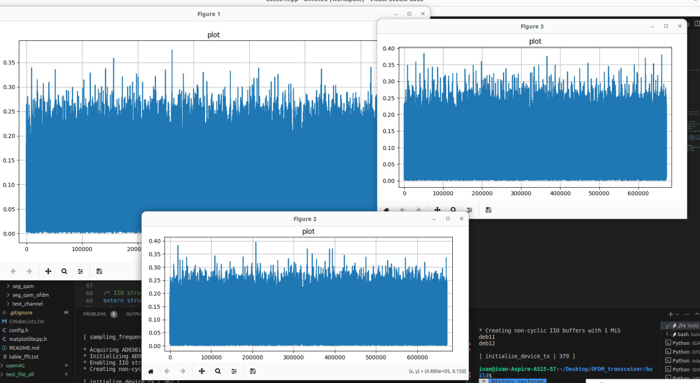

# Прием LTE сигнала

- Требовалось записать LTE сигнал и найти корреляцию по 3-ем PSS

1. Принятый сигнал:

- ширина полосы = 2 МГц
- частота дискритизации 2.1 МГц (взята минимально возможная для libiio v1.0, если ставить меньше выдается ошибка: *Error -22 writing to channel "sampling_frequency" value may not be supported.*)
- Несущая частота = 2.02 ГГц (через приложение была найдена ближайшая базовая станция и взяты ее праметры для DL)

2. Делаем корреляцию по 3 PSS (Root index : 25,29,34) 
  
Генерация PSS  (3GPP TS 36.211 version 13.7.1 Release 13, стр. 127)

 

Выводим корреляцию видим что корреляции практически нет. А на ресурсной сетке мы видели сигнал похожий на PSS, далее за ним следует SSS и канал PBCH. По идеи мы должны увидеть только на одном графике выраженные пики, т.к. автокорреляция pss приближена к нулю.

3. PSS находится в 6 ресурсных блоках, это значит что сигнал занимает 128 поднесущих, у LTE расстояние между поднесущими 15 КГц, 
 15000 * 128 = 1920000 Гц. Т.к. библиотека v1.0 не дает нам поставить такое значение перейдем на версию ниже, v0.23 и примем сигнал с частотой дискритизации 1.92 МГц

4. Принятый сигнал:

5. Повторяем 2 пункт:

- Видим отчетливые корреляционные пики  на PSS c индексом 1.

- пытался сделать частную коррекцию по PSS и по CP, сщещение находит но все равно не то.

