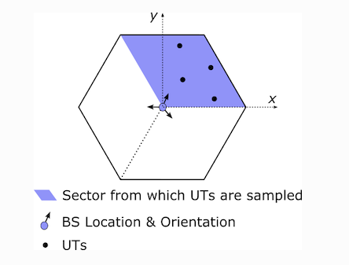
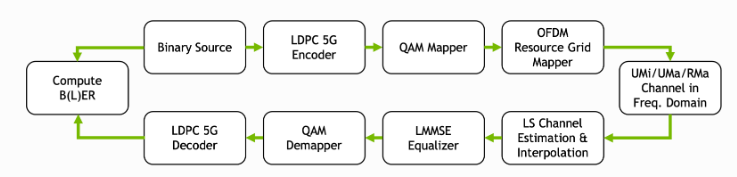
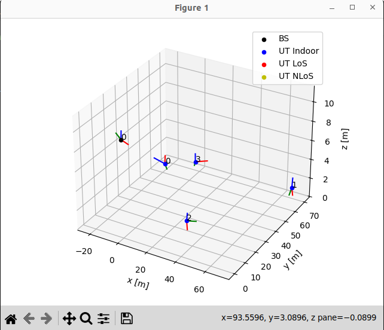
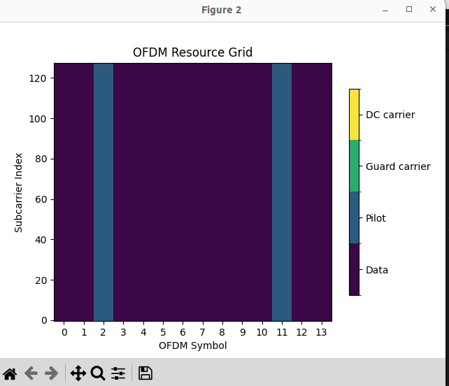
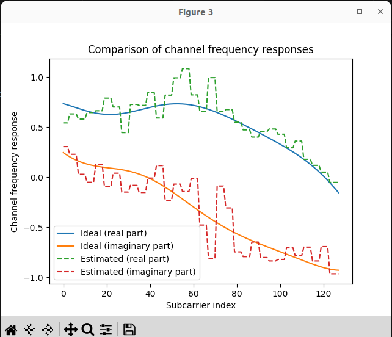
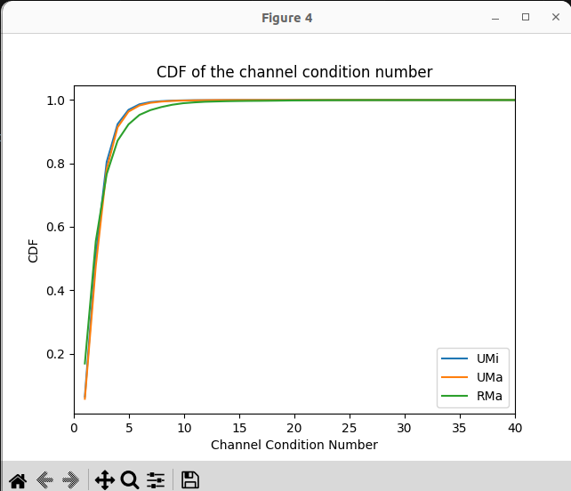
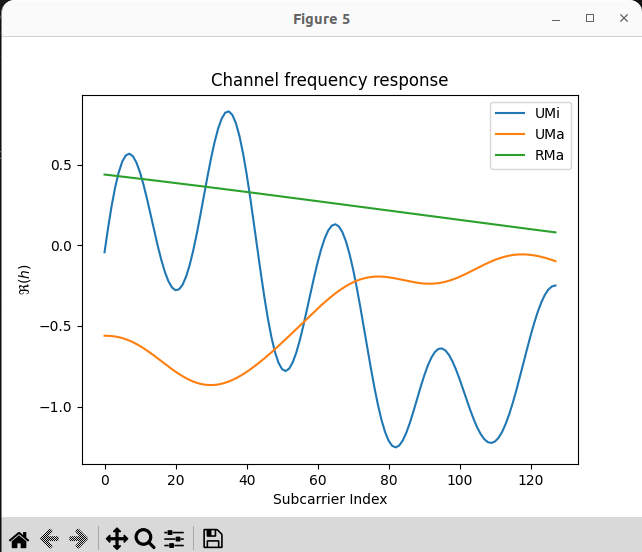
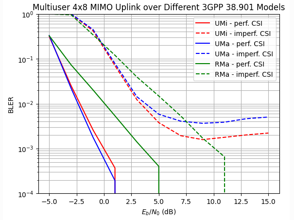

# Реалистичное многопользовательское моделирование MIMO OFDM

-В этой статье мы посмотрим, как настроить реалистичные симуляции многопользовательских MIMO-передач по восходящей линии связи. Несколько пользовательских терминалов (UT) случайным образом распределены в секторе ячейки и взаимодействуют с многоантенной базовой станцией.




Блок-схема модели системы выглядит следующим образом:



В его состав входят следующие компоненты:

- 5G LDPC FEC

- QAM-модуляция

- Сетка ресурсов OFDM с настраиваемым пилотным шаблоном

- Несколько одноантенных передатчиков и многоантенный приемник

- Модели каналов и диаграммы направленности антенн 3GPP 38.901 UMi, UMa и RMa

- Оценка канала LS с интерполяцией ближайшего соседа, а также идеальным CSI

- Выравнивание LMMSE MIMO


1.  Построение топологии



2. Построение ресурсной сетки

- параметры 
```py
                  fft_size=128,
                  subcarrier_spacing=30e3,
                  num_tx=num_ut,
                  num_streams_per_tx=num_streams_per_tx,
                  cyclic_prefix_length=20,
                  pilot_pattern="kronecker",
                  pilot_ofdm_symbol_indices=[2,11]
```



3. Сравниние предполагаемых и фактических частотных характеристик

Теперь мы моделируем пакет передач по восходящей линии связи. Мы сохраняем ссылки на предполагаемые и фактические частотные характеристики канала.



4. Разберем разницу между моделями каналов

    **[UMi, UMa, RMa]**

В следующем фрагменте кода мы вычисляем эмпирическую кумулятивную функцию распределения (CDF) числа обусловленности матрицы частотной характеристики канала между всеми приемными и передающими антеннами.



Из рисунка выше вы можете видеть, что модели UMi и UMa лучше обусловлены, чем модель RMa. Это делает их более подходящими для передач MIMO, это происходит из-за сложности среды. Городская среда характеризуется множеством препятствий (здания, деревья и т.д.), что может вызывать многолучевое распространение сигнала. MIMO использует несколько антенн для передачи и приема сигналов, что позволяет эффективно справляться с многолучевыми эффектами и улучшать качество связи, как мы увидим в следующем разделе.

5. Частотная характеристика каналов этих моделей



Модель RMa имеет значительно меньшую частотную избирательность, чем другие модели, что упрощает оценку канала.

6. Моделирование BER




Из-за худшего согласования канала модель RMa достигает худшей производительности с идеальным CSI(Channel state information). Однако в результате меньшей избирательности частоты несовершенная оценка канала приводит только к почти постоянной потере производительности в 6 дБ. Для моделей UMI и UMa используемый оценщик канала с интерполяцией ближайшего соседа недостаточно точен, поэтому кривые BER насыщаются при высоком SNR. Это можно обойти, например, с помощью другого метода интерполяции (например, линейной интерполяции с усреднением по времени ) или другого пилотного шаблона.

