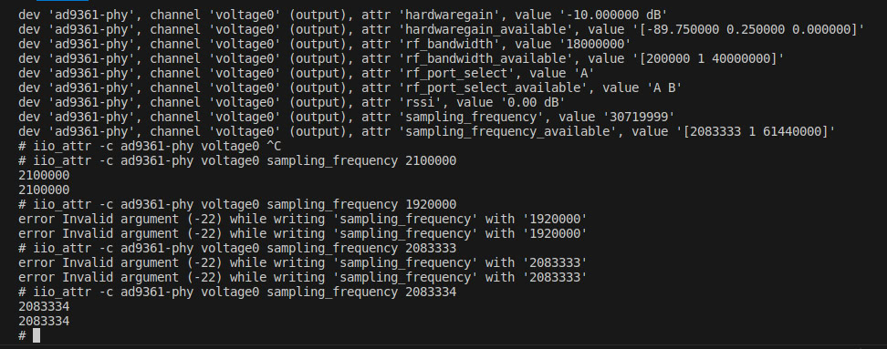

# Sample rate 

Проблема: нет возможности устанивить Sample Rate меньше **2083334 Hz**, при заявленном **512000 Hz**

*Error -22 writing to channel "sampling_frequency" value may not be supported.*

- проблема не правильной настройки отсекается, так как запускал пример из libiio. 

- пробовал настроить на прямую подключившись к SDR через ssh:




такая же проблема

- Переустановил библиотеку с полным удалением всех библиотек и бинарников связаных с библиотекой

```sh
cd /usr

sudo rm -r include/iio
sudo rm  include/iio.h

sudo rm  bin/iio* 

sudo rm lib/x86_64-linux-gnu/libiio*

sudo rm lib/x86_64-linux-gnu/pkgconfig/libiio.pc

sudo rm sbin/iiod
```

- Установил старую версию v0.23

запустил, заработало:


***Но при отключении-подключении SDR перестало работать***

и пока проблема не решена