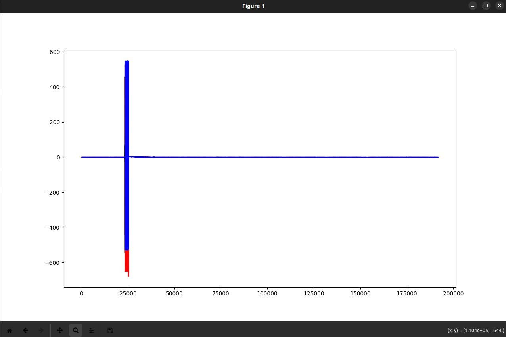

# SoapySDR

- Планирую интегрировать его в наш код вместо libiio. 
Пока что возникают проблемы: запустил пример из sdrLesson (на фото ниже) очень большие амплитуды и , попробовал снизить усиление — проблема остаётся. Убрал отправку данных (программа компилируется), но поведение не изменилось.


- Проблема была в выделении памяти 

Передача QPSK:

<p align="center">
  
  
</p>


- Настройка SDR
```c++
    SoapySDRKwargs args = {};
    SoapySDRKwargs_set(&args, "driver", "plutosdr");
    SoapySDRKwargs_set(&args, "uri", "usb:");
    SoapySDRKwargs_set(&args, "direct", "1");
    SoapySDRDevice *sdr = SoapySDRDevice_make(&args);

```

- Установка частоты дискретизации Несущей частоты

```c++
    if (SoapySDRDevice_setSampleRate(sdr, SOAPY_SDR_TX, 0, FS_2) != 0) {
        std::cerr << "setSampleRate TX failed: " << SoapySDRDevice_lastError() << std::endl;
    }
    if (SoapySDRDevice_setFrequency(sdr, SOAPY_SDR_TX, 0, 1900e6, NULL) != 0) {
        std::cerr << "setFrequency TX failed: " << SoapySDRDevice_lastError() << std::endl;
    }
```
- Отправка семплов 

```c++
 int st = SoapySDRDevice_writeStream(sdr, txStream, (const void * const*)tx_buffs, buffer_size, &flags, tx_time, 400000);
```

- Прием семплов 

```c++
int sr = SoapySDRDevice_readStream(sdr, rxStream, rx_buffs, rx_mtu, &flags, &timeNs, timeoutUs);
```

## Передача OFDM 

- Так максимальный буфер в soapy 1920 семплов, занчит нам нужно раздять наши данные по 1920.

Функция для разделения:

```c++
std::vector<std::vector<std::complex<double>>> split_vector_1920_buff(const std::vector<std::complex<double>>& tx_data) {
    std::vector<std::vector<std::complex<double>>> result;

    // Размер блока
    const size_t block_size = 1920;

    // Количество блоков
    size_t total_blocks = (tx_data.size() + block_size - 1) / block_size;

    // Разделяем вектор на блоки
    for (size_t i = 0; i < total_blocks; ++i) {
        size_t start = i * block_size;
        size_t end = std::min(start + block_size, tx_data.size());
        
        // Создаем блок и копируем данные
        std::vector<std::complex<double>> block(tx_data.begin() + start, tx_data.begin() + end);
        
        // Дополняем нулями, если блок меньше 1920 элементов
        if (block.size() < block_size) {
            block.resize(block_size, std::complex<double>(0.0, 0.0));
        }
        
        result.push_back(std::move(block));
    }

    return result;
}
```

- Отправка и прием идентична

Принятые семплы:


Корреляция по PSS:


Ресурсная сетка после корреляции:


